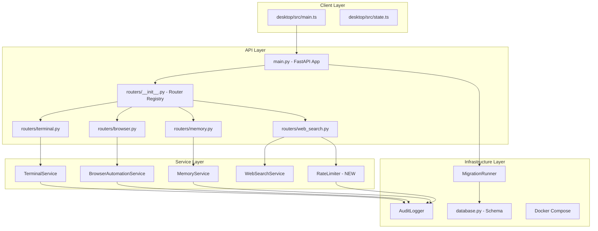

# Design Document: Stabilization Pass

## Overview

This design covers a stabilization, verification, and security-hardening pass on the existing AmpAI codebase. The goal is to make the application production-safe for Docker and desktop deployment without adding new features. The pass addresses eleven areas: router registration auditing, migration runner completeness, memory user isolation, inbox storage migration, web search rate limiting, terminal confirmation hardening, browser automation verification, audit consistency, Docker verification, desktop verification, and a final stabilization report.

All changes are additive or corrective — no new user-facing features are introduced. The focus is on closing security gaps, ensuring data isolation, and verifying that existing functionality works correctly in containerized and desktop environments.

## Architecture

The stabilization pass touches the following layers of the existing architecture:



### Key Architectural Decisions

1. **Rate limiter as middleware/dependency**: The rate limiter is implemented as a FastAPI dependency injected into the web search endpoint, not as global middleware. This keeps the scope narrow and avoids affecting other endpoints.

2. **Confirmation tokens as stateless signed payloads**: Terminal and browser confirmation tokens are implemented as HMAC-signed payloads containing all binding fields (command hash, timestamp, user, session). This avoids needing a separate token store while maintaining security.

3. **Memory inbox migration as startup hook**: The one-time migration from config-list to database runs at application startup, using an idempotent pattern (check-before-insert) to safely handle repeated startups.

4. **Route inventory as startup log**: The route inventory is logged during FastAPI's startup event, after all routers are registered, providing a single source of truth for the active API surface.

## Components and Interfaces

### 1. Router Registration Auditor

**Location**: `main.py` (startup event) + `routers/__init__.py`

**Responsibilities**:
- Detect and skip duplicate route registrations
- Log complete route inventory at startup
- Warn on duplicate detection

**Interface**:
```python
def register_all_with_dedup(app: FastAPI) -> RouteInventory:
    """Register all routers, skip duplicates, return inventory."""
    ...

@dataclass
class RouteInventory:
    routes: List[Tuple[str, str]]  # (method, path)
    duplicates_skipped: List[Tuple[str, str]]
```

### 2. Rate Limiter

**Location**: `services/rate_limiter.py` (new file)

**Responsibilities**:
- Track per-user request counts (per-minute and per-day)
- Use Redis when available, fall back to in-memory
- Return HTTP 429 with descriptive message on limit exceeded
- Log rate limit events to AuditLogger

**Interface**:
```python
class RateLimiter:
    def __init__(self, redis_client: Optional[Redis] = None, audit_logger: Optional[AuditLogger] = None):
        ...

    def check_rate_limit(self, username: str, endpoint: str) -> RateLimitResult:
        """Check if user is within rate limits. Returns result with allowed/denied status."""
        ...

@dataclass
class RateLimitResult:
    allowed: bool
    limit_exceeded: Optional[str]  # "per_minute" | "per_day" | None
    remaining_minute: int
    remaining_day: int
    retry_after_seconds: Optional[int]
```

### 3. Confirmation Token Service

**Location**: `services/confirmation_token.py` (new file)

**Responsibilities**:
- Generate HMAC-signed confirmation tokens bound to specific operations
- Validate tokens (signature, expiry, binding fields)
- Shared by both TerminalService and BrowserAutomationService

**Interface**:
```python
@dataclass
class ConfirmationToken:
    username: str
    session_id: str
    command_hash: str  # SHA-256 of the command/action
    working_directory: Optional[str]
    shell_type: Optional[str]
    action_type: Optional[str]  # For browser tokens
    target_url: Optional[str]   # For browser tokens
    element_selector: Optional[str]  # For browser tokens
    created_at: float  # Unix timestamp
    signature: str

class ConfirmationTokenService:
    TOKEN_TTL_SECONDS = 60

    def generate(self, username: str, session_id: str, command: str, **kwargs) -> ConfirmationToken:
        """Generate a signed confirmation token."""
        ...

    def validate(self, token: ConfirmationToken, command: str, username: str, session_id: str) -> ValidationResult:
        """Validate token signature, expiry, and binding."""
        ...
```

### 4. Memory Inbox Database Backend

**Location**: `routers/memory.py` (modified) + `services/memory_service.py` (modified)

**Responsibilities**:
- Replace `_load_config_list("memory_inbox_candidates")` with database queries
- One-time migration of existing config-list data to `memory_candidates` table
- Enforce user ownership on all inbox operations

**Interface changes**:
- `list_memory_inbox()` → queries `memory_candidates` table directly
- `update_memory_inbox()` → updates `memory_candidates` table, creates `core_memories` row on approve
- `delete_memory_inbox()` → deletes from `memory_candidates` with ownership check

### 5. Memory User Isolation Enforcement

**Location**: `services/memory_service.py` (modified) + `routers/memory.py` (modified)

**Responsibilities**:
- Add username filtering to all memory search paths
- Add ownership verification to approve/reject/delete operations
- Add admin-only cross-user access via `/api/admin/memory/*` endpoints
- Audit all memory access attempts

### 6. Terminal Confirmation Hardening

**Location**: `services/terminal_service.py` (modified)

**Changes**:
- Remove `_confirmed_sessions` set
- Require per-command `ConfirmationToken` validation
- Validate token hash matches the exact command being executed
- Block dangerous commands regardless of token validity

### 7. Browser Automation Verification

**Location**: `services/browser_automation_service.py` (modified)

**Changes**:
- Verify disabled-by-default behavior
- Verify empty allowlist blocks all navigation
- Add `ConfirmationToken` requirement for destructive actions
- Verify headless mode requires admin role

### 8. Audit Consistency Layer

**Location**: `core/audit.py` (verified) + service integrations

**Responsibilities**:
- Ensure every browser action, terminal command, and web search produces an audit event
- Ensure audit failures never crash the user's operation
- Add audit events for rate limit violations and failed access attempts

## Data Models

### ConfirmationToken (new)

```python
@dataclass
class ConfirmationToken:
    username: str
    session_id: str
    command_hash: str        # SHA-256 hex digest
    working_directory: str   # For terminal tokens
    shell_type: str          # For terminal tokens
    action_type: str         # For browser tokens (navigate, click, submit, etc.)
    target_url: str          # For browser tokens
    element_selector: str    # For browser tokens
    created_at: float        # Unix timestamp (time.time())
    signature: str           # HMAC-SHA256 of all fields above
```

### RateLimitState (new, in-memory or Redis)

```
Key format (Redis): "ratelimit:{username}:{endpoint}:minute:{window_id}"
Key format (Redis): "ratelimit:{username}:{endpoint}:day:{date}"
Value: integer counter
TTL: 60s for minute keys, 86400s for day keys
```

### Memory Candidates Table (existing, no schema change)

The existing `memory_candidates` table already has all required columns:
- `id`, `username`, `session_id`, `candidate_text`, `edited_text`
- `source`, `confidence`, `status`, `created_at`, `reviewed_at`

### Route Inventory (logged, not persisted)

```
Format: "{METHOD} {path}" per line at INFO level
Example:
  GET /api/sessions
  POST /api/chat
  POST /api/tools/web-search
  ...
```

## Correctness Properties

*A property is a characteristic or behavior that should hold true across all valid executions of a system — essentially, a formal statement about what the system should do. Properties serve as the bridge between human-readable specifications and machine-verifiable correctness guarantees.*

### Property 1: Route Deduplication

*For any* set of router definitions containing duplicate (method, path) combinations, registering them through the Router_Registry should produce a final route set with no duplicates, and the count of skipped duplicates should equal the number of duplicate entries in the input.

**Validates: Requirements 1.4**

### Property 2: Migration Data Preservation

*For any* existing database state containing valid rows across all tables, running the Migration_Runner should preserve all existing row data unchanged — the row count and content of every pre-existing table should be identical before and after migration.

**Validates: Requirements 2.2**

### Property 3: Migration Idempotence

*For any* set of registered migrations, calling `run_pending()` twice in succession should produce the same final database state as calling it once — the second call should detect all migrations as already applied and skip them.

**Validates: Requirements 2.7**

### Property 4: Memory User Isolation

*For any* two distinct users A and B, and any set of memories owned by each, searching as user A should never return memories owned by user B, and user A attempting to approve, reject, or delete user B's memory should be rejected with HTTP 403.

**Validates: Requirements 3.3, 3.4, 4.5**

### Property 5: Memory Metadata Completeness

*For any* memory save or index operation, the resulting database record and vector index entry should contain the authenticated username, and the vector metadata should include username, session_id, category, memory_id, and status fields.

**Validates: Requirements 3.1, 3.2**

### Property 6: Memory Audit Completeness

*For any* memory operation (write, read, or delete) and any unauthorized access attempt, the Audit_Logger should record an event containing the acting username and target memory identifier.

**Validates: Requirements 3.8, 3.9**

### Property 7: Inbox Migration Idempotence

*For any* set of config-list memory candidates, migrating them to the database should be idempotent — running the migration function multiple times should produce the same set of rows as running it once, with no duplicates created.

**Validates: Requirements 4.2**

### Property 8: Inbox Status Transition Correctness

*For any* valid memory candidate owned by a user, approving it should create exactly one `core_memories` row scoped to that user's username, while rejecting it should update the status without creating any `core_memories` row.

**Validates: Requirements 4.3, 4.4**

### Property 9: Rate Limit Enforcement

*For any* authenticated user, the (N+1)th web search request within a rate limit window should be rejected with HTTP 429 when N equals the configured limit (10 per minute or 100 per day), and each rejection should produce an audit event.

**Validates: Requirements 5.1, 5.2, 5.6**

### Property 10: Terminal Confirmation Token Validation

*For any* terminal command execution when TERMINAL_REQUIRE_CONFIRMATION is true, the command should only execute if a valid ConfirmationToken is presented that: (a) has a signature matching the token's fields, (b) was created within the last 60 seconds, (c) has a command_hash matching the SHA-256 of the command being executed, and (d) is bound to the correct username and session_id.

**Validates: Requirements 6.1, 6.2, 6.3, 6.4**

### Property 11: Dangerous Command Blocking

*For any* command matching the terminal denylist patterns, execution should be blocked regardless of whether a valid ConfirmationToken is presented — the denylist check takes precedence over token validation.

**Validates: Requirements 6.5**

### Property 12: Browser Security Enforcement

*For any* URL when the domain allowlist is empty, navigation should be blocked. *For any* action/target string containing forbidden operation patterns (password store access, MFA bypass, captcha bypass, paywall bypass), the operation should be refused.

**Validates: Requirements 7.2, 7.3**

### Property 13: Browser Confirmation Token Validation

*For any* destructive browser action (login, form submit, POST, DELETE, upload), execution should require a valid ConfirmationToken that: (a) was created within the last 60 seconds, (b) is bound to the exact action type, target URL, and element selector.

**Validates: Requirements 7.4, 7.5, 7.6**

### Property 14: Audit Completeness for Security Actions

*For any* browser action attempt, terminal command attempt (including blocked commands), or web search execution, the Audit_Logger should record an event containing the username, action details, and outcome.

**Validates: Requirements 8.1, 8.2, 8.3**

### Property 15: Audit Failure Resilience

*For any* operation where the Audit_Logger fails to write (e.g., database connection error), the user's original action should complete successfully without raising an exception to the caller.

**Validates: Requirements 8.4**

### Property 16: Desktop Payload Schema Conformance

*For any* chat message sent from the desktop client, the payload should contain all required fields matching the backend `ChatRequest` schema: session_id, message, model_type, model_name, memory_mode, memory_top_k, memory_recency_bias, memory_category_filter, use_web_search, and attachments.

**Validates: Requirements 10.1**

## Error Handling

### Rate Limiter Errors
- **Redis unavailable**: Fall back to in-memory counters silently. Log a warning once on fallback activation.
- **Counter overflow**: Use atomic increment operations. If Redis returns an error, allow the request (fail-open for availability, log the failure).

### Migration Errors
- **Connection failure**: Retry 3 times with 2-second delay. If all retries fail, raise `MigrationConnectionError` and let the application start with degraded functionality.
- **Migration step failure**: Roll back the failed step's transaction. Log the error. Leave all previously applied migrations intact. Raise `MigrationError`.
- **Timeout**: If total migration time exceeds 30 seconds, roll back current step and raise `MigrationTimeoutError`.

### Confirmation Token Errors
- **Invalid signature**: Return 403 with "Invalid confirmation token" message.
- **Expired token**: Return 403 with "Confirmation token expired, please re-confirm" message.
- **Hash mismatch**: Return 403 with "Token does not match the requested command" message.

### Audit Logger Errors
- **Write failure**: Catch all exceptions in `AuditLogger.log()`. Log the failure to the application error log via `logger.error()`. Never propagate the exception to the caller. This is already implemented in the existing `core/audit.py`.

### Memory Isolation Errors
- **Ownership mismatch**: Return HTTP 403 with "Forbidden" detail. Log a failed-access audit event.
- **Memory not found**: Return HTTP 404. Do not reveal whether the memory exists for another user.

### Docker Startup Errors
- **Database unreachable**: Migration runner retries handle this. If all retries fail, the app starts but database-dependent features are unavailable.
- **Redis unreachable**: Rate limiter falls back to in-memory. Other Redis-dependent features degrade gracefully.

## Testing Strategy

### Testing Framework
- **Python backend**: `pytest` with `pytest-asyncio` for async tests
- **Property-based testing**: `hypothesis` library for Python
- **Desktop client**: TypeScript type checking via `tsc --noEmit`

### Dual Testing Approach

**Unit tests** (example-based):
- Router registration with known duplicate sets
- Migration runner with intentionally failing migrations
- Rate limiter at exact boundary (10th request passes, 11th fails)
- Confirmation token with specific expired/mismatched scenarios
- Docker compose config validation
- Desktop payload structure verification

**Property tests** (hypothesis-based, minimum 100 iterations each):
- Memory user isolation across random user pairs
- Confirmation token validation across random commands and timestamps
- Rate limit enforcement across random request patterns
- Route deduplication across random route sets
- Inbox status transitions across random candidates
- Audit completeness across random operations

### Property Test Configuration
- Library: `hypothesis` (Python)
- Minimum iterations: 100 per property
- Each test tagged with: `Feature: stabilization-pass, Property {N}: {title}`
- Tests located in `tests/properties/` directory

### Integration Tests
- Docker startup and health check
- Full route inventory verification
- End-to-end memory isolation with real database
- Rate limiter with real Redis

### Test Organization
```
tests/
├── properties/
│   ├── test_route_dedup.py
│   ├── test_migration_idempotence.py
│   ├── test_memory_isolation.py
│   ├── test_inbox_transitions.py
│   ├── test_rate_limiter.py
│   ├── test_confirmation_tokens.py
│   ├── test_browser_security.py
│   └── test_audit_completeness.py
├── unit/
│   ├── test_router_registration.py
│   ├── test_migration_runner.py
│   ├── test_terminal_hardening.py
│   ├── test_browser_verification.py
│   └── test_desktop_payload.py
└── integration/
    ├── test_docker_startup.py
    └── test_route_inventory.py
```
