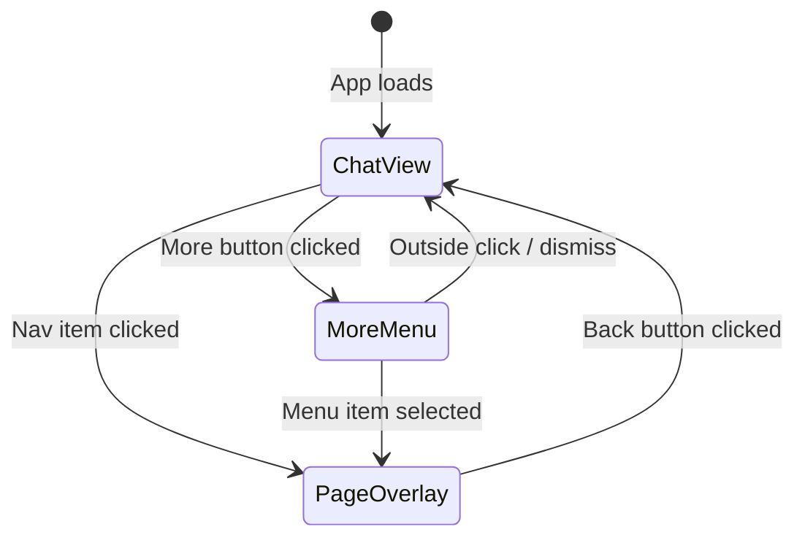
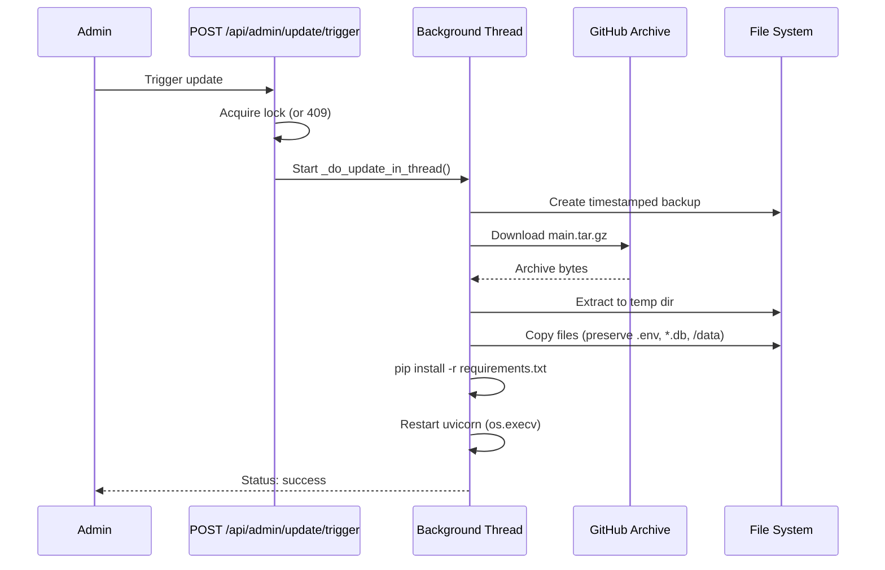

# Design Document: UI Redesign Full-Page

## Overview

This design addresses three interconnected improvements to the AmpAI application:

1. **UI Layout Overhaul** — Replace the sidebar-panel navigation with a full-page view architecture. The chat view is the default screen, and all other sections (History, Memory, AI Models, etc.) open as full-page overlays with a compact bottom/side navigation bar.

2. **Docker Update Fix** — Rewrite the `_do_update_in_thread()` function to reliably download code from a GitHub archive URL (since `.git` is excluded from the Docker image), extract it, back up current files, apply the update while preserving user data, install dependencies, and restart the server.

3. **Model Selector Fix** — Ensure the chat topbar and AI Models page use the `ALL_PROVIDERS` constant (10 providers) instead of the filtered `S.providers` list from the backend, and dynamically fetch models via `GET /api/models/fetch/{provider}` on provider change.

### Current State

- `render()` in `main.ts` already has partial full-page layout code (page-overlay, nav-bar, more-menu) but still references legacy sidebar structures and the `chatTopbar()` uses `S.providers` as a fallback which only contains backend-filtered providers.
- `_do_update_in_thread()` in `main.py` tries `git fetch/reset` first (fails because `.git` is in `.dockerignore`), then falls back to archive download. The fallback works but the git path logs confusing errors.
- `tabs-c.ts` (Settings) correctly uses `ALL_PROVIDERS` for the settings form, but `chatTopbar()` in `main.ts` falls back to a hardcoded 7-provider list instead of `ALL_PROVIDERS`.
- `tabs-ai.ts` renders provider cards and model lists from `S.providerModels` but the fetch-on-provider-change wiring in `bind()` doesn't always trigger re-render.

## Architecture

```mermaid
graph TD
    subgraph Frontend ["Desktop App (TypeScript/Vite)"]
        R[render()] --> CV[Chat View + Nav Bar]
        R --> PO[Page Overlay Views]
        CV --> TB[Chat Topbar - Model Selector]
        TB --> AP[ALL_PROVIDERS constant]
        TB --> PM[S.providerModels cache]
        PO --> AI[AI Models Page]
        PO --> UP[Update Page]
        NB[Nav Bar] --> CV
        NB --> PO
    end

    subgraph Backend ["FastAPI Backend (Python)"]
        MR[/api/models/fetch/{provider}] --> ExtAPI[External Provider APIs]
        UT[/api/admin/update/trigger] --> DU[Docker Updater]
        DU --> GH[GitHub Archive Download]
        DU --> BK[Backup Manager]
        DU --> RS[Server Restart]
    end

    TB -->|fetch models| MR
    AI -->|fetch models| MR
    UP -->|trigger update| UT
```

### Navigation Flow



### Docker Update Flow



## Components and Interfaces

### Frontend Components

#### 1. `render()` — Main Render Function

**Responsibility:** Determine current view state and render either Chat View (with nav bar) or a Page Overlay.

**Interface:**
```typescript
function render(): void
// Reads S.tab to determine view
// S.tab === "server" → Chat View + Nav Bar
// S.tab === any other valid tab → Page Overlay
// S.tab === "more" → Chat View + Nav Bar + More Menu overlay
```

**Key change:** Remove all legacy sidebar code. The function should have exactly two rendering paths: chat-fullscreen (default) and page-overlay (all other tabs).

#### 2. `chatTopbar()` — Model Selector in Chat

**Responsibility:** Render the chat header with provider/model dropdowns.

**Interface change:**
```typescript
function chatTopbar(): string
// MUST use ALL_PROVIDERS for provider dropdown (not S.providers)
// MUST show fetched models from S.providerModels[S.modelType]
// MUST show loading state when models are being fetched
```

#### 3. `navItem()` / `renderMoreMenu()` — Navigation

**Responsibility:** Render compact nav bar items and the more-menu overlay.

**Interface:**
```typescript
function navItem(id: string, icon: string, label: string): string
function renderMoreMenu(): string
```

#### 4. `aiTab()` — AI Models Full Page

**Responsibility:** Display all providers, their status, and dynamically fetched model lists.

**Interface (unchanged):**
```typescript
function aiTab(): string
// Uses ALL_PROVIDERS for provider grid
// Displays S.providerModels[currentProvider] for model list
// Triggers fetch via data-fetch-models attribute
```

#### 5. Model Fetch Handler (in `bind()`)

**Responsibility:** On provider change in topbar or AI page, fetch models from backend.

**Interface:**
```typescript
// In bind():
// sel-provider change → S.modelType = value, fetch /api/models/fetch/{provider}
// data-fetch-models click → fetch /api/models/fetch/{provider}
// data-select-provider click → S.modelType = value, fetch models, re-render
```

### Backend Components

#### 6. `_do_update_in_thread()` — Docker Updater (Rewritten)

**Responsibility:** Download latest code from GitHub archive, extract, backup, apply, install deps, restart.

**Interface (unchanged externally):**
```python
def _do_update_in_thread(actor: str) -> None
```

**Key changes:**
- Remove the `git fetch/reset` path entirely (`.git` is not available in Docker)
- Go directly to GitHub archive download
- Use `https://github.com/{slug}/archive/refs/heads/main.tar.gz` as primary URL
- Preserve: `.env`, `*.db`, `*.db-journal`, `/data/` directory, `agent_data/`
- Add explicit error handling for each step with proper lock release

#### 7. `GET /api/models/fetch/{provider}` — Dynamic Model Fetching

**Responsibility:** Fetch available models from a provider's API and return structured list.

**Current implementation is correct.** Supports: ollama, openrouter, openai, gemini, anthropic, generic.

**Missing providers to add:** groq, mistral, cohere (currently return 400 "Unsupported provider").

### State Management

```typescript
// Key state fields for this feature:
S.tab: string              // Current active view ("server" = chat, others = page overlay)
S.modelType: string        // Currently selected provider
S.modelName: string        // Currently selected model ID
S.providerModels: Record<string, Model[]>  // Cached fetched models per provider
S.providers: Provider[]    // Backend-filtered providers (NOT used for topbar anymore)
S.updateStatus: object     // Docker update state
S.updateLog: string[]      // Docker update log lines
```

## Data Models

### Frontend Types (existing, no changes needed)

```typescript
// From state.ts — already defined
type Provider = { value: string; label: string; local: boolean; urlField: string; keyField: string };
type Model = { id: string; name: string; free?: boolean; context_length?: number; local?: boolean; description?: string };

// ALL_PROVIDERS: Provider[] — 10 entries (ollama, openrouter, openai, gemini, anthropic, groq, mistral, cohere, generic, anythingllm)
```

### Backend Models

```python
# /api/models/fetch/{provider} response
{
    "provider": str,
    "models": [
        {
            "id": str,           # Model identifier
            "name": str,         # Display name
            "provider": str,     # Provider name
            "context_length": int,
            "free": bool,
            "local": bool,
            "description": str   # Truncated to 200 chars (OpenRouter only)
        }
    ],
    "count": int
}

# /api/admin/update/status response
{
    "state": "idle" | "running" | "success" | "error",
    "started_at": str | None,
    "finished_at": str | None,
    "error": str | None,
    "log_lines": list[str]
}
```

### Docker Update Preserved Files

During the archive-based update, the following paths are preserved (not overwritten):
- `.env` — Environment configuration
- `*.db`, `*.db-journal` — SQLite databases
- `/data/` — Mounted volume (agent_data, uploads, backups)
- `docker-compose.yml` — User's compose overrides

## Correctness Properties

*A property is a characteristic or behavior that should hold true across all valid executions of a system — essentially, a formal statement about what the system should do. Properties serve as the bridge between human-readable specifications and machine-verifiable correctness guarantees.*

### Property 1: Navigation produces page-overlay with back button

*For any* valid non-chat tab identifier (account, history, memory, ai, tasks, browser, terminal, personas, settings, personalise, telegram, admin, update), when `S.tab` is set to that identifier, `render()` SHALL produce HTML containing a `page-overlay` container with a back button element inside it.

**Validates: Requirements 1.2, 1.4**

### Property 2: Active tab is highlighted in nav-bar

*For any* valid primary nav tab (server, history, memory, ai, tasks), when `S.tab` equals that tab identifier, the rendered nav-bar SHALL contain exactly one nav-item with the "active" class, and that item's `data-nav` attribute SHALL match the current tab.

**Validates: Requirements 2.5**

### Property 3: File copy preserves protected files during update

*For any* set of application files and any set of protected files (`.env`, `*.db`, `*.db-journal`, files under `/data/`), after the Docker updater copies extracted archive files over the application directory, all protected files SHALL have identical content to their pre-update state.

**Validates: Requirements 3.4**

### Property 4: Concurrent update lock enforcement

*For any* two concurrent calls to `POST /api/admin/update/trigger`, exactly one SHALL succeed (return 200 and start the update) and the other SHALL be rejected with HTTP 409. After the first update completes (success or error), the lock SHALL be released.

**Validates: Requirements 3.12**

### Property 5: Provider dropdown contains all ALL_PROVIDERS entries

*For any* application state, the `chatTopbar()` function SHALL produce a provider `<select>` element containing an `<option>` for every entry in the `ALL_PROVIDERS` constant (all 10 providers), regardless of the value of `S.providers`.

**Validates: Requirements 4.3, 6.1**

### Property 6: Provider change triggers model fetch and updates dropdown

*For any* provider value from `ALL_PROVIDERS`, when the user changes the provider dropdown, the application SHALL call `GET /api/models/fetch/{provider}` and upon success, store the returned models in `S.providerModels[provider]` and re-render the model dropdown with those models.

**Validates: Requirements 4.2, 6.2, 6.4**

### Property 7: Free models display visual indicators

*For any* model object where `free === true`, the rendered model item (in both the AI Models page and the chat topbar model dropdown) SHALL contain a visual free indicator ("FREE" badge in the AI page, "✦" symbol in the topbar dropdown). For any model where `free === false`, no free indicator SHALL be present.

**Validates: Requirements 4.4, 6.5**

### Property 8: OpenRouter model parsing extracts all required fields

*For any* valid OpenRouter API model response object containing `id`, `name`, `context_length`, `pricing`, and `description` fields, the `fetch_provider_models("openrouter")` function SHALL return a model object with: `id` (string), `name` (string), `context_length` (number), `free` (boolean, true iff prompt and completion pricing are both "0"), and `description` (string, truncated to 200 characters).

**Validates: Requirements 5.2**

### Property 9: Model sorting — free first, then alphabetical

*For any* list of model objects returned by `GET /api/models/fetch/{provider}`, all models with `free === true` SHALL appear before all models with `free === false`, and within each group (free/paid), models SHALL be sorted alphabetically by `name`.

**Validates: Requirements 5.3**

## Error Handling

### Frontend Errors

| Scenario | Handling |
|----------|----------|
| Model fetch fails (network/API error) | Show toast with error message; retain previously cached models in `S.providerModels` |
| Provider API returns 400 (no key configured) | Show toast "API key not configured for {provider}"; keep existing models |
| Provider API returns 502 (provider unreachable) | Show toast "Cannot reach {provider}"; keep existing models |
| Page data load fails | Show toast with error; render page with empty/stale data |
| Update trigger returns 409 | Show toast "Update already in progress" |

### Backend Errors (Docker Updater)

| Step | Failure | Handling |
|------|---------|----------|
| Archive download | Network timeout, 404, DNS failure | Log error, set state="error", release lock |
| Archive extraction | Corrupt zip, disk full | Log error, set state="error", release lock, clean temp files |
| Backup creation | Disk full, permission denied | Log error, set state="error", release lock |
| File copy | Permission denied | Log error, set state="error", release lock |
| pip install | Package not found, network issue | Log warning, continue to restart (non-fatal) |
| Server restart | os.execv failure | Log error, set state="error" |

### Backend Errors (Model Fetching)

| Provider | Failure | Response |
|----------|---------|----------|
| Any | API key missing (cloud providers) | HTTP 400 with detail message |
| Any | Provider API unreachable | HTTP 502 with detail message |
| Any | Timeout | HTTP 502 with timeout detail |
| Unknown | Unsupported provider name | HTTP 400 "Unsupported provider" |

## Testing Strategy

### Property-Based Testing

This feature is suitable for property-based testing in the following areas:
- Model sorting logic (pure function, clear input/output)
- OpenRouter model parsing (data transformation)
- Provider dropdown rendering (deterministic HTML generation from state)
- Free model indicator rendering (deterministic based on model.free flag)
- File preservation during update (can be tested with mock filesystem)

**Library:** [fast-check](https://github.com/dubzzz/fast-check) for TypeScript frontend tests, [Hypothesis](https://hypothesis.readthedocs.io/) for Python backend tests.

**Configuration:** Minimum 100 iterations per property test.

**Tag format:** `Feature: ui-redesign-fullpage, Property {number}: {property_text}`

### Unit Tests (Example-Based)

| Area | Tests |
|------|-------|
| `render()` | Default state renders chat-fullscreen; setting tab renders page-overlay |
| `chatTopbar()` | Contains all 10 providers; shows cached models; shows loading state |
| `navItem()` | Renders correct icon, label, active class |
| `renderMoreMenu()` | Contains all secondary items; admin items only for admin role |
| `getPageContent()` | Returns valid content for all 14 tab identifiers |
| Docker updater | Download failure sets error state; extraction failure sets error state; pip failure is non-fatal |
| Update lock | Second concurrent request returns 409 |
| Model fetch | Returns structured models for each supported provider |

### Integration Tests

| Area | Tests |
|------|-------|
| `loadTabData("ai")` | Calls /api/models/options then /api/models/fetch/{provider} |
| Provider change flow | Changing sel-provider triggers fetch and re-render |
| Update polling | Polls /api/admin/update/status every 3s while state is "running" |
| Archive download | End-to-end download from GitHub (mocked HTTP) |

### Dual Testing Approach

- **Property tests** verify universal correctness (sorting, parsing, rendering invariants) across randomized inputs
- **Unit tests** verify specific scenarios, edge cases, and error paths
- **Integration tests** verify component wiring and API communication
